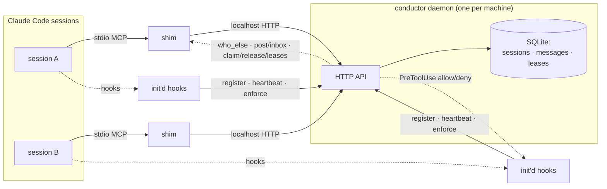

# conductor

Session orchestration for Claude Code: sessions that are aware of each other,
talk to each other, and coordinate on shared projects.

**Thesis:** sessions are workers; work needs a bus. Claude Code coordinates
subagents *within* a session and nothing *across* sessions ... no awareness, no
messaging, no conflict prevention, no way to throw a second session at a job in
progress. Conductor is that missing layer, built from three mechanics Claude
Code already exposes: an **MCP server** for the bus, **hooks** for
registration and enforcement, and **transcripts** for awareness.

## Two war stories (why this exists)

Both are real incidents from this portfolio's history, and both are the same
shape: **two uncoordinated sessions, one project.**

1. **The stale-local-main squash merge.** A session branched from local `main`
   that held another session's unpushed commits, and dragged them into an
   unrelated squash merge under its own PR title.
2. **The launch-docs publication.** A session merged work that published draft
   documents another session was still writing.

Neither session knew the other existed. The first thing conductor gives you is
that they now do ... and the second is that it stops the collision before it
happens:


<details>
<summary>Transcript of the recording</summary>

```console
$ conductor ps
SESSION    STATUS   PROJECT                BRANCH   SEEN
a3f2c118   active   …/tmp.v2yiirQc5s       main     0s ago
b7e19d04   active   …/tmp.v2yiirQc5s       main     0s ago

LEASE  SCOPE                HOLDER     EXPIRES
#1     path:src/main/**     a3f2c118   in 59m
#2     branch:main          a3f2c118   in 59m

── Act 1 ── session b7e19d04 tries to EDIT a file a3f2 has leased:
  🚫 LEASE CONFLICT: session a3f2c118 (task: refactoring the parser) holds
     path:src/main/**; the file src/main/Parser.java is covered by
     path:src/main/**. The lease expires in ~59m. Coordinate first: use
     conductor `post` to message a3f2c118, or `claim` disjoint work. Do not
     edit here until they release it.

── Act 2 ── the same session tries a conflicting `git merge` (the stale-main incident):
  🚫 LEASE CONFLICT: session a3f2c118 (task: preparing the release merge) holds
     branch:main; a `git merge` touches branch main, leased as branch:main. The
     lease expires in ~59m. Coordinate first: use conductor `post` to message
     a3f2c118, or `claim` disjoint work. Do not edit here until they release it.
```

</details>

The recording is scripted, not hand-captured:
[`demo/war-story.tape`](demo/war-story.tape) drives
[`demo/war-story.sh`](demo/war-story.sh) with
[vhs](https://github.com/charmbracelet/vhs) against the real conductor daemon
and the real PreToolUse enforcement hook, so `vhs demo/war-story.tape`
reproduces it from a clean clone. No network, no API key.

## Architecture

One daemon per machine owns a SQLite registry behind a localhost HTTP API.
Sessions touch it two ways: **hooks** (installed by `conductor init`) call the
daemon on session lifecycle and before every mutating tool call, and a
per-session **stdio MCP shim** gives the session the bus tools. A stdio MCP
server is spawned once per session (verified — see
[docs/GROUND-TRUTH.md](docs/GROUND-TRUTH.md) §4.2), so shared state has to live
in the daemon, not the shim.



- **Registry** — sessions (id, project, branch, worktree, task, freshness,
  redacted activity digest) and messages. Past-TTL sessions show `stale`,
  never vanish.
- **Leases** — advisory locks on `repo:` / `path:<glob>` / `branch:<name>`
  scopes, with a TTL. A **PreToolUse hook** on `Write`/`Edit`/`Bash` checks
  them and blocks a conflicting write or history-moving git command with a
  message naming the holder.
- **Fail-open** — if the daemon is down, hooks exit 0 (never block a tool),
  bus tools return "unavailable", and `ps` says loudly that leases are
  unenforced. A dead coordinator must not stop work.
- **Authority boundary** — conductor never edits code, never merges, never
  approves. It schedules, informs, and blocks conflicting writes ... the same
  boundary as agent-medic's Surgeon: system-wide visibility earns observation
  and veto, never a pen.

## Quickstart

```console
$ mvn -DskipTests package
$ java -jar target/conductor.jar init          # install hooks into ./.claude/settings.local.json
$ java -jar target/conductor.jar ps            # who's on this project, and what leases are held
```

`init` writes into `.claude/settings.local.json` (per-user; Claude Code
gitignores it) so conductor is never committed onto a teammate. It is
**additive** to your existing hooks, and `conductor remove` strips exactly
conductor's entries.

Register the MCP shim once (user scope covers every project):

```console
$ claude mcp add-json --scope user conductor \
    '{"type":"stdio","command":"java","args":["-jar","'"$PWD"'/target/conductor.jar","mcp-shim"]}'
```

Then, inside any session in that project, the bus tools are available:
`who_else`, `post` / `inbox`, and `claim` / `release` / `leases`. Add this to
the project's `CLAUDE.md` so sessions check in at the natural boundaries
(conductor ships polling-first — no magic context injection):

```markdown
## Coordinating with other sessions (conductor)
- At task start, and before any commit, PR, or merge: call `who_else`, then
  `inbox`. Before editing shared files, `claim` the scope; if another session
  holds it, coordinate over `post`.
```

## Roadmap

- [x] **Phase 0** — ground truth + design ([GROUND-TRUTH.md](docs/GROUND-TRUTH.md), [DESIGN.md](docs/DESIGN.md))
- [x] **Phase 1** — bus + registry + hooks: `who_else` / `post` / `inbox`, `conductor init` / `ps`, two sessions mutually visible
- [x] **Phase 2** — leases + fail-open enforcement: `claim` / `release` / `leases`, PreToolUse block on Write/Edit and history-moving git (the war-story GIF)
- [ ] **Phase 3** — transcript awareness + briefing: consent flow (`conductor observe`), redacted digests, `brief_me`
- [ ] **Phase 4** — `assist`: worktree + headless helper spawn with a briefing bundle, PR-based integration (the finish-faster GIF)
- [ ] **Phase 5** — dogfood + case study from a real coordinated week

## Contract

The bus's MCP surface is contract-tested with
[mcp-pact](https://github.com/hhagenbuch/mcp-pact) in CI
([pacts/conductor-bus.mcp-pact.json](pacts/conductor-bus.mcp-pact.json)):
renaming or reshaping any bus tool becomes a red build.
